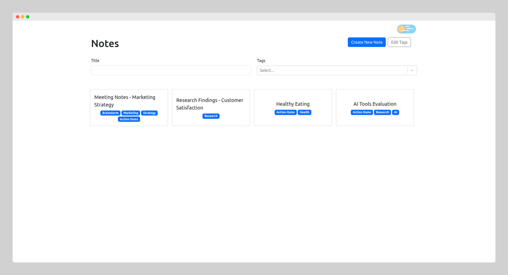
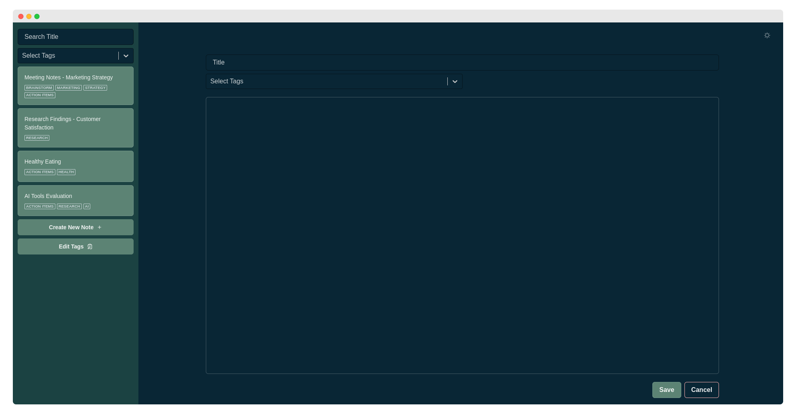
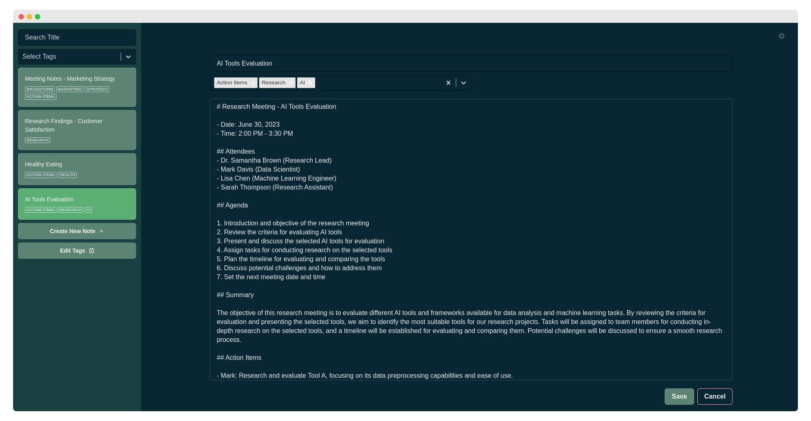
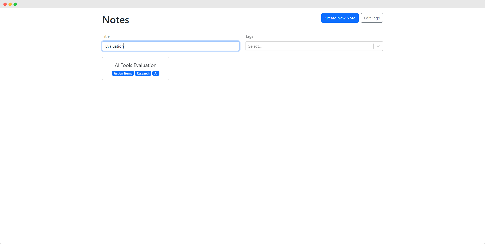
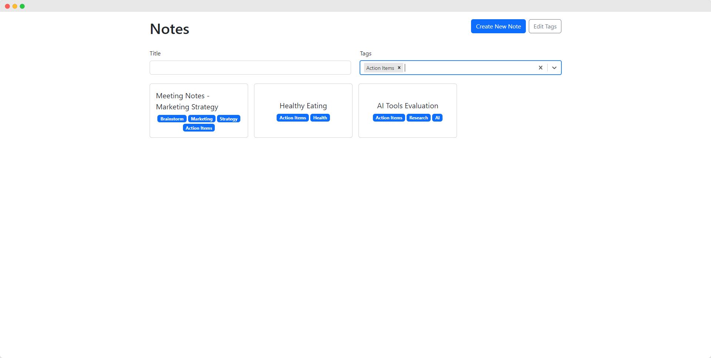

# React-NoteTaker

React-NoteTaker is a simple note-taking application built with React. It provides a user-friendly interface for creating and managing notes, with support for Markdown formatting.

## Table of contents

- [Features](#features)
- [Technologies](#technologies-used)
- [Demo](#demo)
- [Usage](#usage)
- [Todo](#todo-future-plans)
- [License](#license)
- [Contact](#contact)

## Features

- **Create and Capture:** Seamlessly create new notes by providing a title and content. Capture your thoughts, ideas, and important information effortlessly.

- **Effortless Editing:** Edit your existing notes with ease. Update the title or content of a note anytime you need to refine or expand your thoughts.

- **Smart Organization:** Assign tags to your notes for smart organization. Categorize your notes into custom tags to easily classify and retrieve them later.

- **Filter with Precision:** Quickly find the notes you need using the advanced filtering feature. Filter notes based on titles, tags, or a combination of both, ensuring you find the right information in no time.

- **Automatic Tag Updates:** Enjoy seamless tag management. When you update a tag, React-NoteTaker automatically reflects the changes across all notes tagged with that specific tag. Say goodbye to manual tag updates and save valuable time.

- **Intuitive User Interface:** React-NoteTaker boasts an intuitive and user-friendly interface. With its clean design and straightforward navigation, you can focus on your notes without any distractions.

- **Responsive and Fast:** Whether you're accessing React-NoteTaker from your desktop or mobile device, it offers a responsive experience. Enjoy fast performance, ensuring smooth note-taking and effortless interaction.

## Technologies Used

- :label: TypeScript v4.3
- :atom_symbol: React v18
- :link: React Router v6
- :art: Bootstrap v5
- :gear: Zustand v4
- :arrow_down: React Select v5.7
- :pencil: React Markdown v8.0
- :key: uuid v9.0

## Demo

Check out the live demo of React-NoteTaker:

- :globe_with_meridians: **Live Page:** https://idrisgit.github.io/React-NoteTaker

  > :memo: **Note:** The current version of React-NoteTaker uses local storage to save the notes. Therefore, the notes will be stored locally in your browser. Keep this in mind when using the demo, as clearing your browser data may result in the loss of your notes

## Usage

Here's a brief demonstration of how to use React-NoteTaker:

1. **Homepage**: Upon launching the application, user is presented with the homepage where all their notes are displayed.

   

2. **Create New Note**: Users can click on the "Create New Note" button to create a new note. They can enter the title, content, and optionally assign tags to categorize the note.

   

3. **Edit Note**: To edit an existing note, user can click on the "Edit" button associated with the specific note. This opens a form where they can update the title, content, or tags of the note.

   

4. **Filter Notes**: React-NoteTaker allows users to filter notes based on title and tags. They can enter a search query in the search bar to filter notes by title. Additionally, they can select tags from the tag filter dropdown to display only the notes associated with those tags.

   |                   Filter by Title                   |                    Filter by Tags                     |
   | :-------------------------------------------------: | :---------------------------------------------------: |
   |  |  |

5. **Edit Tags**: Users can manage the available tags in the application by accessing the "Edit Tags" functionality. Here, they can add new tags, remove existing ones, or update the labels of the tags.

   

## TODO (Future Plans)

Here are some of the upcoming features that will be added:

1. :white_check_mark: **Real-time Markdown Preview**: Implement a feature that provides a real-time preview of Markdown formatting to the user.
2. **Dark Mode**: Introduce a dark mode option for users who prefer a darker color scheme for the application.
3. **Deploy with GitHub Actions**: Implement the deployment process using GitHub Actions to automate the deployment process.
4. **User Authentication**: Implement user authentication functionality to allow users to create accounts, login, and securely access their notes.
5. **Move Notes Storage to Database**: Migrate the notes storage from local storage to a database to ensure persistent storage and enable users to access their notes across devices.

Feel free to suggest more features or enhancements that you would like to see in React-NoteTaker. Contributions and ideas are welcome!

## License

React-NoteTaker is licensed under the [MIT License](LICENSE.md).

## Contact

If you have any questions, suggestions, or feedback, please feel free to contact me.

Email: idris.gadi01@gmail.com  
GitHub: https://github.com/IdrisGit

Thank you for using React-NoteTaker!
