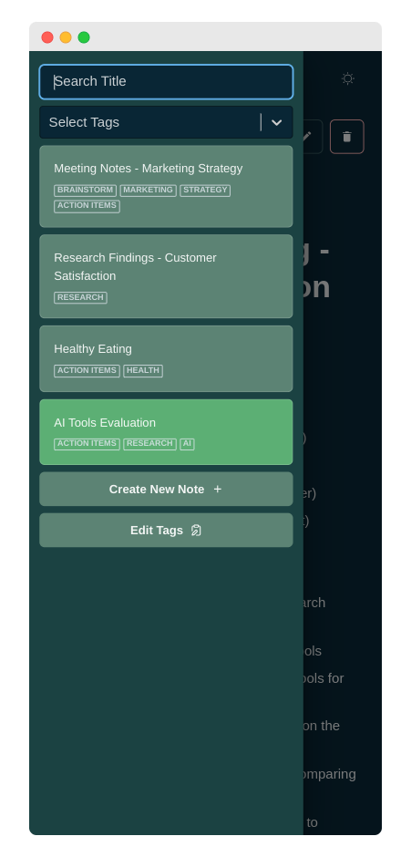

# MarkUp: Notes Simplified

MarkUp is a local-first note-taking application. It features a clean and simple interface for creating and managing notes, with full support for Markdown formatting.

> [!NOTE]
>  This is my personal hobby project, where I explore and experiment with new technologies and ideas. Feel free to browse the code and follow along with my learning journey.

## Table of contents

- [Features](#features)
- [Technologies](#technologies-used)
- [Demo](#demo)
- [Screenshots](#screenshots)
- [License](#license)
- [Contact](#contact)

## Features

- **Create and Capture:** Seamlessly create new notes by providing a title and content. Capture your thoughts, ideas, and important information effortlessly.
  
- **Local-First Data Storage:** MarkUp adopts a local-first approach for data storage, ensuring your notes are securely saved locally. Benefit from enhanced privacy and accessibility, even without an internet connection.
  
- **Effortless Editing:** Edit your existing notes with ease. Update the title or content of a note anytime you need to refine or expand your thoughts.

- **Smart Organization:** Assign tags to your notes for smart organization. Categorize your notes into custom tags to easily classify and retrieve them later.

- **Filter with Precision:** Quickly find the notes you need using the advanced filtering feature. Filter notes based on titles, tags, or a combination of both, ensuring you find the right information in no time.

- **Real-time Markdown Preview:** See a live preview of your notes as you write them in Markdown. Instantly visualize how your formatted text will look, making it easier to create well-structured content.

- **Automatic Tag Updates:** Enjoy seamless tag management. When you update a tag, MarkUp automatically reflects the changes across all notes tagged with that specific tag. Say goodbye to manual tag updates and save valuable time.

- **Intuitive User Interface:** MarkUp boasts an intuitive and user-friendly interface. With its clean design and straightforward navigation, you can focus on your notes without any distractions.

- **Responsive and Fast:** Whether you're accessing MarkUp from your desktop or mobile device, it offers a responsive experience. Enjoy fast performance, ensuring smooth note-taking and effortless interaction.
- **Dark Mode:** Customize your note-taking experience with Dark Mode. Easily switch between light and dark themes to suit your preference.

## Technologies Used

- :label: TypeScript v5
- :atom_symbol: React v18
- :link: React Router v6
- :file_cabinet: RxDB (Database)
- :art: ~~Bootstrap v5~~ Chakra UI v2.8
- :bear: Zustand v4
- :arrow_down: React Select v5.7
- :pencil: React Markdown v8.0
- :key: uuid v9.0

## Demo

Check out the live demo of MarkUp:

- :globe_with_meridians: **Live Page:** [https://idrisgit.github.io/MarkUp](https://idrisgit.github.io/MarkUp/#demo)

## Screenshots

1. **Homepage**:

   

2. **Create New Note**:

   

3. **Edit Note**:

   

4. **Color Modes**:

   |                  Dark Mode                   |                   Light Mode                   |
   | :------------------------------------------: | :--------------------------------------------: |
   |  |  |

5. **Edit Tags**:

   

6. **Mobile Responsive**:
<table style="width: 100%">
   <tr>
      <td align="center">
         
      </td>
      <td align="center">
         
      </td>
   </tr>
</table>

## License

MarkUp is licensed under the [MIT License](LICENSE.md).

## Contact

If you have any questions, suggestions, or feedback, please feel free to contact me.

Email: idris.gadi01@gmail.com  
GitHub: https://github.com/IdrisGit

Thank you for using MarkUp!
