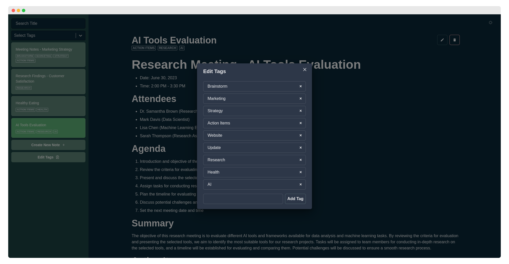

# MarkUp: Notes Simplified

MarkUp is a simple note-taking application built with React. It provides a user-friendly interface for creating and managing notes, with support for Markdown formatting.

## Table of contents

- [Features](#features)
- [Technologies](#technologies-used)
- [Demo](#demo)
- [Usage](#usage)
- [Todo](#todo-future-plans)
- [License](#license)
- [Contact](#contact)

## Features

- **Create and Capture:** Seamlessly create new notes by providing a title and content. Capture your thoughts, ideas, and important information effortlessly.

- **Effortless Editing:** Edit your existing notes with ease. Update the title or content of a note anytime you need to refine or expand your thoughts.

- **Smart Organization:** Assign tags to your notes for smart organization. Categorize your notes into custom tags to easily classify and retrieve them later.

- **Filter with Precision:** Quickly find the notes you need using the advanced filtering feature. Filter notes based on titles, tags, or a combination of both, ensuring you find the right information in no time.

- **Real-time Markdown Preview:** See a live preview of your notes as you write them in Markdown. Instantly visualize how your formatted text will look, making it easier to create well-structured content.

- **Automatic Tag Updates:** Enjoy seamless tag management. When you update a tag, MarkUp automatically reflects the changes across all notes tagged with that specific tag. Say goodbye to manual tag updates and save valuable time.

- **Intuitive User Interface:** MarkUp boasts an intuitive and user-friendly interface. With its clean design and straightforward navigation, you can focus on your notes without any distractions.

- **Responsive and Fast:** Whether you're accessing MarkUp from your desktop or mobile device, it offers a responsive experience. Enjoy fast performance, ensuring smooth note-taking and effortless interaction.
- **Dark Mode:** Customize your note-taking experience with Dark Mode. Easily switch between light and dark themes to suit your preference.

## Technologies Used

- :label: TypeScript v5
- :atom_symbol: React v18
- :link: React Router v6
- :art: ~~Bootstrap v5~~ Chakra UI v2.8
- :bear: Zustand v4
- :arrow_down: React Select v5.7
- :pencil: React Markdown v8.0
- :key: uuid v9.0

## Demo

Check out the live demo of MarkUp:

- :globe_with_meridians: **Live Page:** [https://idrisgit.github.io/React-NoteTaker](https://idrisgit.github.io/React-NoteTaker/#demo)

  > :warning: **Note:** The current version of MarkUp uses local storage to save the notes. Therefore, the notes will be stored locally in your browser. Keep this in mind when using the demo, as clearing your browser data may result in the loss of your notes

## Usage

Here's a brief demonstration of how to use MarkUp:

1. **Homepage**:

   

2. **Create New Note**:

   

3. **Edit Note**:

   

4. **Filter Notes**:

   |                  Dark Mode                   |                   Light Mode                   |
   | :------------------------------------------: | :--------------------------------------------: |
   |  |  |

5. **Edit Tags**:

   

6. **Mobile Responsive**:
<table style="width: 100%">
   <tr>
      <td align="center">
         
      </td>
      <td align="center">
         
      </td>
   </tr>
</table>

## TODO (Future Plans)

Here are some of the upcoming features that will be added:

1. :white_check_mark: **Real-time Markdown Preview**: Implement a feature that provides a real-time preview of Markdown formatting to the user.
2. :white_check_mark: **Dark Mode**: Introduce a dark mode option for users who prefer a darker color scheme for the application.
3. **PWA (Progressive Web App) Implementation:** Convert the application into a Progressive Web App (PWA) to provide offline access, app-like behavior, and the ability for users to install it on their devices for a seamless mobile experience.
4. **Deploy with GitHub Actions**: Implement the deployment process using GitHub Actions to automate the deployment process.
5. **User Authentication**: Implement user authentication functionality to allow users to create accounts, login, and securely access their notes.
6. **Move Notes Storage to Database**: Migrate the notes storage from local storage to a database to ensure persistent storage and enable users to access their notes across devices.

Feel free to suggest more features or enhancements that you would like to see in MarkUp. Contributions and ideas are welcome!

## License

MarkUp is licensed under the [MIT License](LICENSE.md).

## Contact

If you have any questions, suggestions, or feedback, please feel free to contact me.

Email: idris.gadi01@gmail.com  
GitHub: https://github.com/IdrisGit

Thank you for using MarkUp!
